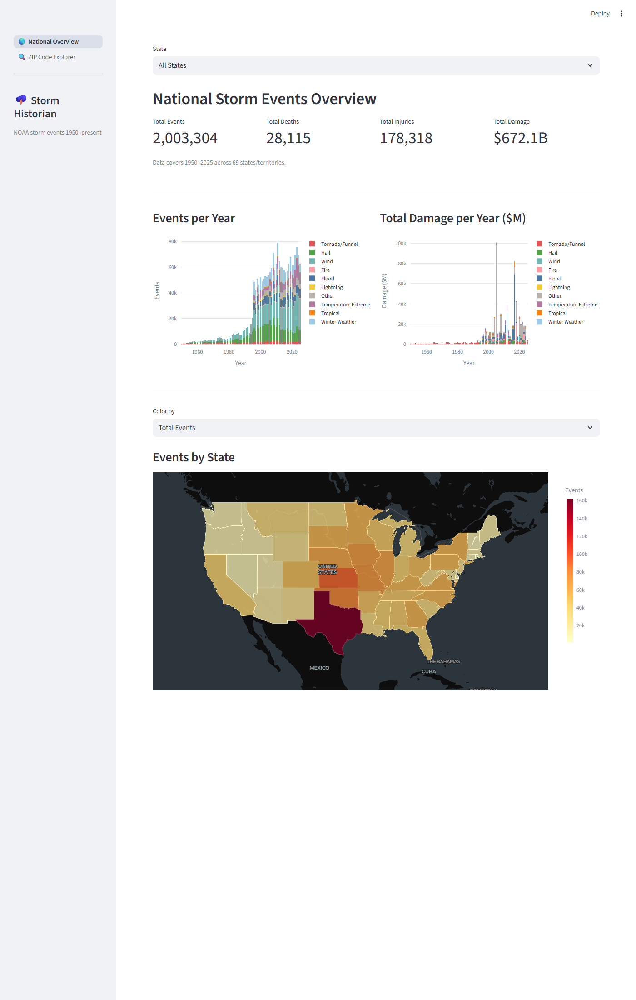
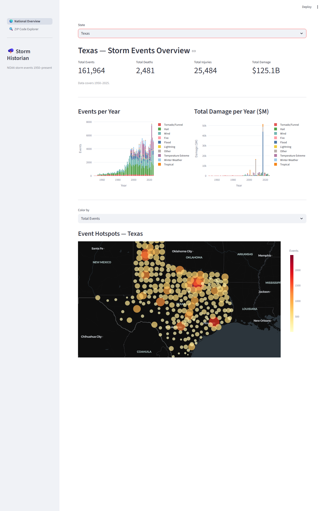
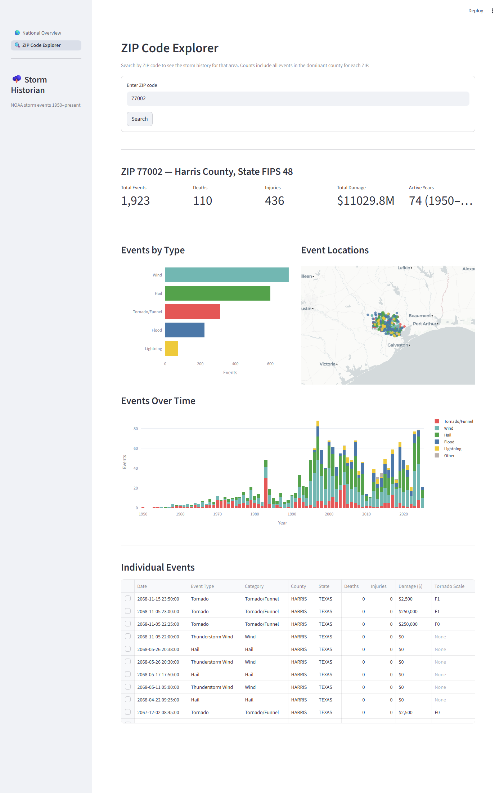

# Storm Historian

> A complete ELT data engineering project — from raw NOAA files to an interactive storm events analytics app.

Storm Historian automates the discovery, download, and transformation of 75+ years of publicly available weather data from [NOAA's Storm Events Database](https://www.ncei.noaa.gov/pub/data/swdi/stormevents/csvfiles/), then surfaces it through a Streamlit dashboard with national and per-state analysis, county-level hotspot maps, and ZIP code–level event lookups.

**2,000,000+ events · 1950–2025 · 50 states + territories · $672B in recorded damage**

---

## Screenshots

### National Overview
The landing page shows national summary metrics, color-coded stacked bar charts of events and damage by year (broken down by storm category), and an interactive choropleth map colored by total events, deaths, or damage.



---

### State Drill-Down
Select any state from the dropdown to filter all metrics, charts, and the map to that state. The choropleth is replaced by a county-level bubble map sized by the selected metric.



---

### ZIP Code Explorer
Look up any US ZIP code to see a breakdown of storm event types, a year-over-year trend chart, an event location scatter map, and a sortable/filterable table of individual events.



---

## Features

- **Automated ingestion** — discovers and incrementally downloads new/updated files from NOAA; only fetches what has changed
- **Full ELT pipeline** — raw CSV.GZ files → DuckDB staging → dbt-transformed marts → read-only explore database
- **dbt data model** — staging, intermediate, and mart layers with data quality tests baked in
- **National Overview** — summary KPIs, stacked bar charts by storm category, and a tile-based choropleth map with three color axes (events / deaths / damage)
- **State drill-down** — filter the entire dashboard to a single state; choropleth swaps for a county-level bubble hotspot map
- **ZIP Code Explorer** — per-ZIP event history with charts, a scatter map, and a searchable event table
- **Dark tile maps** — all maps use the Carto Dark Matter tile basemap via Plotly's `scatter_map` / `choropleth_map`

---

## Tech Stack

| Layer | Technology |
|---|---|
| Language | Python 3.12+ |
| Package manager | [Poetry](https://python-poetry.org/) |
| Database | [DuckDB 1.4](https://duckdb.org/) |
| Data transformation | [dbt-duckdb 1.10](https://github.com/duckdb/dbt-duckdb) |
| DataFrame library | [Polars 1.35](https://pola.rs/) |
| Web app | [Streamlit 1.52](https://streamlit.io/) |
| Charts & maps | [Plotly 6.5](https://plotly.com/python/) |
| HTTP / scraping | Requests, BeautifulSoup4 |
| Data validation | [Pydantic v2](https://docs.pydantic.dev/) |
| Linting | Ruff, SQLFluff |

---

## Architecture

```
┌─────────────────────────────────────────────────────────────────┐
│                        NOAA FTP Server                          │
│          ncei.noaa.gov/pub/data/swdi/stormevents/csvfiles/      │
└───────────────────────────┬─────────────────────────────────────┘
                            │  HTTP scrape + incremental download
                            ▼
┌─────────────────────────────────────────────────────────────────┐
│  Ingestion  (src/storm_historian/ingestion/)                     │
│  ┌─────────────────┐    ┌──────────────────┐                    │
│  │ discover_files  │    │   pull_file       │                    │
│  │ scrapes index & │───▶│ downloads new /   │                    │
│  │ logs metadata   │    │ modified files    │                    │
│  └─────────────────┘    └────────┬─────────┘                    │
│           ▲  state tracking      │                              │
│           └── warehouse.duckdb   │                              │
└──────────────────────────────────┼──────────────────────────────┘
                                   │ data/raw/  *.csv.gz
                                   ▼
┌─────────────────────────────────────────────────────────────────┐
│  dbt Transformation  (storm_history_dbt/)                        │
│                                                                  │
│  Sources  →  Base (typed)  →  Staging (cleaned)                 │
│                              ↓                                   │
│                         Intermediate (aggregates)               │
│                              ↓                                   │
│                            Marts                                 │
│   fct_storm_events · agg_events_by_state_year                   │
│   agg_events_by_zip · dim_zip_codes · fct_fatalities            │
└──────────────────────────────┬──────────────────────────────────┘
                               │  warehouse_build.duckdb
                               │  → copied to warehouse_explore.duckdb
                               ▼
┌─────────────────────────────────────────────────────────────────┐
│  Streamlit App  (src/app/)                                       │
│  ┌─────────────────────┐   ┌─────────────────────────────────┐  │
│  │  National Overview  │   │  ZIP Code Explorer              │  │
│  │  choropleth · KPIs  │   │  per-ZIP charts · map · table   │  │
│  │  state hotspot map  │   │                                 │  │
│  └─────────────────────┘   └─────────────────────────────────┘  │
└─────────────────────────────────────────────────────────────────┘
```

---

## dbt Model Layers

```
storm_history_dbt/models/
│
├── _sources/               ← raw DuckDB external table declarations
│   ├── raw_files.yml       ← reads *.csv.gz directly via DuckDB read_csv
│   └── storm_events.yml
│
├── staging/                ← base + staging: type-cast and clean raw columns
│   ├── base_storm_event__details.sql
│   ├── base_storm_event__fatalities.sql
│   ├── base_storm_event__locations.sql
│   ├── stg_storm_event_details.sql
│   ├── stg_storm_event_fatalities.sql
│   └── stg_storm_event_locations.sql
│
├── intermediate/           ← pre-aggregations used by marts
│   ├── int_storm_event__fatality_agg.sql
│   ├── int_storm_event__location_agg.sql
│   └── int_storm_event_details__damage_parsed.sql
│
└── marts/                  ← analytics-ready, app-facing tables
    ├── fct_storm_events.sql          ← main fact table (event_category, lat/lon, damage)
    ├── fct_fatalities.sql
    ├── agg_events_by_state_year.sql  ← pre-aggregated for trend charts
    ├── agg_events_by_zip.sql         ← pre-aggregated for ZIP explorer
    ├── dim_zip_codes.sql             ← ZIP → county crosswalk (Census data)
    ├── dim_event_types.sql
    └── dim_locations.sql
```

Data quality tests (uniqueness, not-null, referential integrity, coordinate bounds) are defined in `schema.yml` files and run as part of `dbt build`.

---

## Installation

### Prerequisites

- Python 3.12+
- [Poetry](https://python-poetry.org/docs/#installation)

### Setup

```bash
# Clone the repo
git clone https://github.com/<your-username>/storm_historian.git
cd storm_historian

# Install Python dependencies
poetry install

# Install dbt packages
make dbt-deps
```

---

## Usage

### Full pipeline (recommended)

```bash
make build
```

This runs the complete pipeline in one command:
1. Discovers new/updated files from NOAA
2. Downloads them to `data/raw/`
3. Runs `dbt build` (all models + all tests)
4. Copies the built database to `warehouse_explore.duckdb` for the app

### Step-by-step

```bash
# 1. Discover and download new NOAA files
make ingest

# 2. Build dbt models and run data quality tests
make dbt-build

# 3. (Optional) Download the Census ZIP→county crosswalk and re-seed
make seed-crosswalk
```

### Launch the app

```bash
make app
```

Opens at `http://localhost:8501` by default.

### dbt commands

```bash
make dbt-run       # run models only (skip tests)
make dbt-test      # run tests only
make dbt-compile   # compile SQL without executing
make dbt-docs      # generate + serve dbt documentation
make dbt-debug     # check dbt connection
make dbt-clean     # remove target/ and dbt_packages/
```

---

## Project Structure

```
storm_historian/
├── src/
│   ├── streamlit_app.py             ← app entry point
│   ├── app/
│   │   ├── db.py                    ← DuckDB connection + cached query helpers
│   │   └── pages/
│   │       ├── overview.py          ← National Overview page
│   │       └── zip_explorer.py      ← ZIP Code Explorer page
│   └── storm_historian/
│       └── ingestion/
│           ├── discover_files.py    ← scrapes NOAA FTP index
│           ├── pull_file.py         ← downloads files incrementally
│           ├── source_info.yml      ← data source configuration
│           └── source_model.py      ← Pydantic models
├── storm_history_dbt/
│   ├── dbt_project.yml
│   ├── profiles.yml
│   ├── models/                      ← see dbt Model Layers above
│   ├── macros/
│   │   └── parse_noaa_damage.sql    ← custom macro for damage string parsing
│   ├── seeds/
│   │   └── zip_county_crosswalk.csv ← Census ZIP→county mapping
│   └── tests/                       ← custom singular data tests
├── data/
│   ├── duckdb/
│   │   ├── warehouse_build.duckdb   ← dbt build target
│   │   └── warehouse_explore.duckdb ← read-only copy for the app
│   └── raw/                         ← downloaded CSV.GZ files from NOAA
│       ├── storm_event_details/
│       ├── storm_event_fatalities/
│       └── storm_event_locations/
├── docs/
│   └── screenshots/                 ← UI screenshots
├── makefile
└── pyproject.toml
```

---

## Environment Variables

| Variable | Default | Description |
|---|---|---|
| `STORM_DUCKDB_PATH` | `data/duckdb/warehouse_build.duckdb` | Build database path (used by dbt) |
| `STORM_DUCKDB_EXPLORE` | `data/duckdb/warehouse_explore.duckdb` | Read-only app database path |

---

## Development

```bash
# Lint Python
poetry run ruff check src/

# Format Python
poetry run ruff format src/

# Lint SQL (dbt models)
poetry run sqlfluff lint storm_history_dbt/models/

# Run Python tests
poetry run pytest
```

---

## Data Source

Data is sourced from NOAA's public Storm Events Database:

- **Database**: https://www.ncei.noaa.gov/pub/data/swdi/stormevents/
- **Data Catalog**: https://catalog.data.gov/dataset/ncdc-storm-events-database
- **Documentation**: https://www.ncei.noaa.gov/pub/data/swdi/stormevents/csvfiles/Storm-Data-Bulk-csv-Format.pdf

NOAA data is provided as a public service. Please refer to NOAA's terms and conditions when using or redistributing this data.

---

## License

MIT

